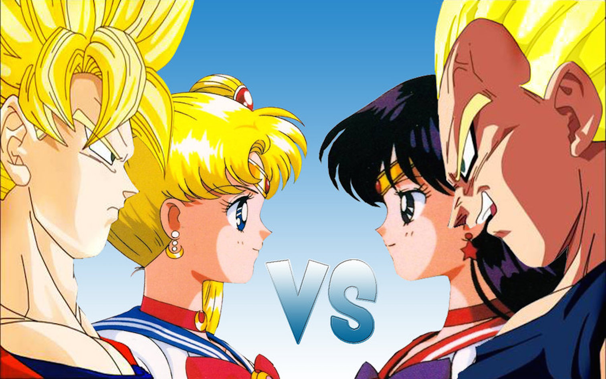

# Fight Game

## Descripition 
This application is a fighting game where the user can pick if its Sailor Moon vs Sailor Mars or Goku vs Vegeta. After the user picks the players, they simply click the fight button until one of the players health points hit zero and a winner is declared. The following coding languages were used to build this application Javascript, CSS, and HTML with a foundation framework. In additon, I have made a flowchart for this application. Click [here](https://github.com/kcossifos/Portfolio/blob/Javascript/FightGame/FlowChart.pdf) to view the Fight Game flowchart. To view this application go to [FightGame](https://kcossifos.github.io/Portfolio/FightGame/index.html)

## Getting Started
```
First make sure you have some kind of code editior installed on your computer
If not, I recommed installing Atom at https://atom.io
Now clone this repository to get started by typing git clone https://github.com/kcossifos/Portfolio.git
```

## HTML DOM Element Objects
The following HTML DOM elements that are used in this application

**querySelector()** method returns the first child element that matches a specified CSS selector(s) of an element.

HTML File:
```
<div id="scores">
	<div id="kabal">
		<p id ="startfight"></p>
		<p id = "health">100</p>

	</div>

	<div id="kratos">
		<p id="startfight2"></p>
		<p id="health2">100</p>
	</div>
	<div class="clear"></div>
</div>
```

Javascript File:
```
  document.querySelector("#health").innerHTML = players[0].health;
  document.querySelector("#health2").innerHTML = players[1].health;
  document.querySelector("#startfight").innerHTML = players[0].name;
  document.querySelector("#startfight2").innerHTML = players[1].name;
```

**addEventListener()** method attaches an event handler to the specified element

HTML File:
```
<div id="fight_box">
  <div id="fight_btn">
		<form id="round_number">
		  <input id="result" value="Round 1 - Tied"></input>
		</form><br>
		<a href="#" class="buttonblue">FIGHT!</a>
	</div>
	<div id="fight_bg">
		
	</div>
</div>
```

Javascript File:
```
  var btn = document.querySelector("#fight_btn");
  btn.addEventListener("click", fight, false);
```


